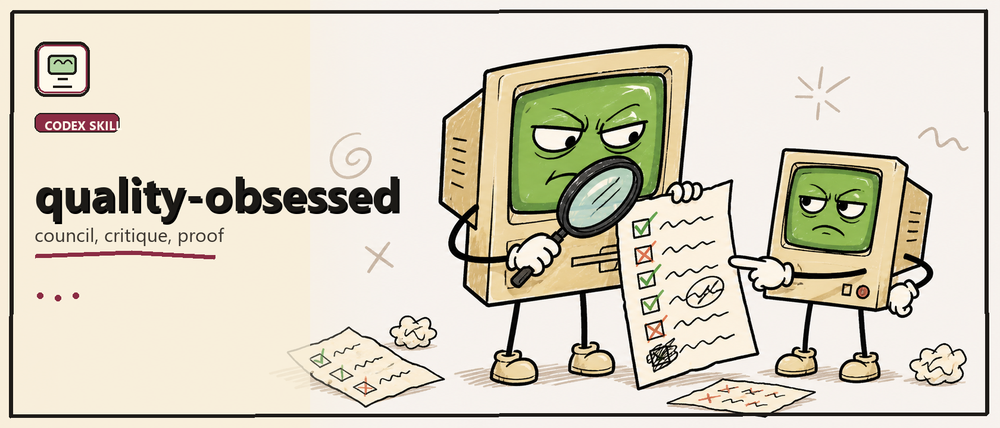

# Quality Obsessed

> Codex skill pack for quality-delta execution, critique loops, adjacent audits, and proof-driven finishing.

Quality Obsessed is a workflow skill for making work visibly better, not just more documented. It helps Codex set a baseline, challenge weak results, inspect nearby impact, run critique loops, and finish with evidence.

- Define the floor, ceiling, and quality contract before broad work.
- Use the council pass internally for adjacent impact, ambition, mission control, and critique.
- Push beyond competent when the user asks for polish, excellence, or a stronger direction.
- Keep proof attached to the artifact: tests, screenshots, reviewed output, or clear blockers.
- Stop honestly when the result does not beat the baseline.

## Quick Install

Download this repo or ask Codex to install `quality-obsessed` in your workspace.

## What's Inside

- [`SKILL.md`](./SKILLS/quality-obsessed/SKILL.md): main quality-delta process.
- [`references/council.md`](./SKILLS/quality-obsessed/references/council.md): council entrypoint folded into this skill.
- [`references/council/`](./SKILLS/quality-obsessed/references/council): adjacent audit, advisor autonomy, ambition, mission control, and critic passes.
- [`references/`](./SKILLS/quality-obsessed/references): exceptional bar, transformation gate, iteration loop, visual analysis, and orchestration.

## Status

Preview skill pack.

- Council material is internal to `quality-obsessed`.
- Best for substantial, review-sensitive, visual, product, code, docs, and prototype work.
- Not meant to turn every tiny task into a ceremony.

## License

MIT.
