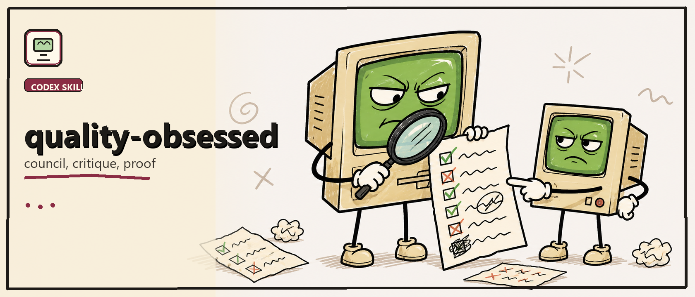

# Quality Obsessed



> A portable [Agent Skills](https://agentskills.io/) workflow for evidence-gated, persistent quality missions and context-adaptive professional councils: inspect the real artifact, improve the authorized surface, and prove every material claim.

[](./LICENSE)
[](#status)

The runtime contract is agent-agnostic. It works with Codex, Claude Code, OpenCode, and other clients or open-source models that can load the Agent Skills format. Product-specific metadata is additive and never required to understand the workflow.

## Use it when

- The user explicitly asks for obsessive, exhaustive, baseline-beating quality.
- A prior result was rejected as bland, generic, fragile, or incomplete.
- A difficult artifact needs a persistent eval-driven improvement loop.
- A quality council needs professional lenses adapted to the artifact instead of a fixed panel.
- The task needs adversarial evidence without confusing task completion with artifact quality.

Do not activate it implicitly for routine fixes, ordinary reviews, explanations, or status checks. Explicit invocation still works for any task.

## Install

The Skills CLI can install the package for supported agents and lets you choose the target host and scope when needed:

```powershell
npx skills@1.5.15 add gvastethecreator/quality-obsessed
```

For manual project installation, copy or link `SKILLS/quality-obsessed` to the host's skill directory:

| Host | Project location | User location | Typical explicit invocation |
|---|---|---|---|
| Codex | `.agents/skills/quality-obsessed` | `~/.agents/skills/quality-obsessed` | Run `/skills`, mention `$quality-obsessed`, or choose it from the skill picker |
| Claude Code | `.claude/skills/quality-obsessed` | `~/.claude/skills/quality-obsessed` | `/quality-obsessed` |
| OpenCode | `.opencode/skills/quality-obsessed` | `~/.config/opencode/skills/quality-obsessed` | Ask the agent to load `quality-obsessed`; OpenCode uses its native skill tool |
| Generic Agent Skills host | `.agents/skills/quality-obsessed` when supported | Host-specific | Use the host's explicit skill mechanism |

OpenCode also discovers Claude-compatible `.claude/skills` and agent-compatible `.agents/skills` locations. See the official [Codex skills](https://developers.openai.com/codex/skills), [Claude Code skills](https://code.claude.com/docs/en/slash-commands), and [OpenCode Agent Skills](https://dev.opencode.ai/docs/skills) documentation for host-specific discovery and permissions.

After copying the complete folder, verify discovery through the host rather than assuming the path worked: use `/skills` in Codex, `/quality-obsessed` in Claude Code, `opencode debug skill` in OpenCode, or the equivalent skill inventory in a generic host.

## Contract

The skill separates three questions that older quality workflows often conflate:

- task_state: `completed | blocked` — whether the requested work completed. Use `blocked` only when an external constraint prevents meaningful continuation, not when the artifact is weak.
- artifact_verdict: `win | tie | loss | not-assessed` — whether the artifact beats the baseline or acceptance target; use `not-assessed` when no honest comparison is available.
- verification_state: `verified | limited | unverified` — whether claims have complete proof, partial proof with named gaps, or no usable proof.

For example, `completed + loss + verified` means an audit finished successfully, proved its conclusion, and found that the artifact does not meet the target.

It selects one mission mode:

- `change`: improve only the authorized target.
- `diagnose`: determine cause without silently implementing a fix.
- `audit`: inspect and report without mutating the target.
- `recovery`: replace a rejected or losing direction.
- `goal`: pursue an explicitly durable objective through checkpoints.

Every evidence gate is selected as required, conditional, or not applicable. Desktop-only software does not invent mobile proof; documentation counts as an artifact; static inspection cannot certify runtime or visual claims.

## Execution discipline

The skill captures the purpose that changes acceptance, acts once the minimum facts are known, and reuses settled facts and decisions until new evidence changes them. An approval, access, or user-input blocker stops only its own lane while safe independent work remains. Milestone and final claims must point to current evidence or a durable proof record tied to the same artifact revision.

Code changes receive a final structural check for ad-hoc branches, thin pass-through wrappers, leaked feature logic, and avoidable file sprawl. Before ending, the skill completes any safe in-scope work still promised by its response. A requested plan, audit, or explanation counts as the deliverable; other work ends when the requested result is done or explicitly blocked.

## Context-adaptive Council

Council is a compact branch, not a separate framework or fixed cast. Activate it when the user explicitly requests one or when two or more materially different failure modes need judgment together. Select 2-4 non-overlapping lenses from the artifact, outcome, risk, and professional domain, then make every lens inspect the same real evidence and converge on one decision, next artifact move, and closing proof.

The professional lens changes with the work. A realtime visual-effects application should include a **Professional VFX Artist / Technical Director** perspective; an audio mastering application should include a **Professional Mastering Engineer**; games, financial workflows, and developer platforms should receive their own relevant specialists. Supporting lenses exist only when they add material judgment. Internal personalities remain structured self-review, not independent review, unless a fresh external or delegated reviewer actually participates.

## Creative Search

Creative Search activates only for an explicit creative, standout, greenfield, or direction-risk request. It is skipped for routine fixes and conformance work. Build three cheap representative artifacts with materially different theses, structures, or behaviors; compare them on user value, signature, feasibility, and proof; and choose one explicitly. Do not default to a hybrid. Add one memorable useful signature, subtract one generic or diluting element, then run a blind audience read without the brief: understood, action, memory, mismatch. Resolve material mismatch before commit. The detailed route and evidence contract lives in [creative-search.md](./SKILLS/quality-obsessed/references/creative-search.md).

## Deep persistence

Deep persistence activates when the user explicitly asks for an obsessive, exhaustive, no-limit, baseline-beating, or durable goal-like mission. It also activates by default for an explicitly invoked substantial, broad, or quality-sensitive mission when the user supplies no budget, time limit, or loop count and meaningful in-scope weaknesses remain. A routine small or explicitly bounded task does not inherit 10 loops, and loading durable task-record guidance alone does not activate them. Persistent work inside the current task does not require a durable goal:

- Exactly one mandatory floor: 10 valid loops once Deep Persistence activates.
- No hard maximum.
- Dynamic evidence-backed backlog; no pre-invented quota of 10 weaknesses.
- Compact epochs of five loops.
- Loop 10 verdict: `continue`, `ask`, or `stop`; repeat the judgment at later epoch boundaries while continuing.
- A host-specific durable-run capability is used only when the user explicitly requests it.

Loop count is never the quality claim. The artifact and its proof decide the verdict.

## Model-routed orchestration

Routing begins with a value check: delegation is optional, and the orchestrator may execute directly when work is small, serial, context-coupled, or cheaper to do than hand off. Only actual dispatches receive a model label. The defaults are contextual: settled-input reports and non-critical execution use `gpt-5.6-luna` with `medium` reasoning; detailed implementation with settled decisions, documentation, context, tasks, and proof uses `gpt-5.6-luna` with `max`; planning, specs, tickets, architecture, completed-work reviews, and other important judgment use `gpt-5.6-sol` with `xhigh`.

These are defaults, not invariants. The orchestrator may choose another route for task shape, risk, dependencies, context locality, proof cost, or host capability, and records the reason when the deviation is material. Compatible work stays on one route until evidence changes the classification, reducing repeated handoffs and model churn.

Review depth follows risk. Focused proof plus orchestrator reconciliation can close low-risk output; a separate Sol/xhigh review is not mandatory for every Luna task. Prefer Sol/xhigh when a distinct review is useful for important, high-risk, ambiguous, subjective, or user-requested work, using `accept`, `repair`, or `reset` when a formal review runs. Per task, run focused checks only; run repository-wide tests, builds, and typechecks once at the integration boundary or final batch. If a route is unavailable, execute directly or use the closest available option and disclose the fallback when it materially affects trust, cost, or review strength. See [orchestration.md](./SKILLS/quality-obsessed/references/orchestration.md) for the full contract.

## Package layout

- [SKILL.md](./SKILLS/quality-obsessed/SKILL.md): compact router and core loop.
- [protocol.md](./SKILLS/quality-obsessed/references/protocol.md): canonical modes, state axes, severities, and transitions.
- [evidence.md](./SKILLS/quality-obsessed/references/evidence.md): applicable-gate manifest and proof rules.
- [creative-search.md](./SKILLS/quality-obsessed/references/creative-search.md): explicit creative direction search, signature/subtraction, and blind audience read.
- [persistence.md](./SKILLS/quality-obsessed/references/persistence.md): dynamic deep persistence and continuation policy.
- [orchestration.md](./SKILLS/quality-obsessed/references/orchestration.md): role-based planning, delegation, and Codex model routing.
- [pressure.md](./SKILLS/quality-obsessed/references/pressure.md): context-adaptive Council, adversarial autopsy, and independent pressure.
- [host-capabilities.md](./SKILLS/quality-obsessed/references/host-capabilities.md): agent-agnostic capability mapping.
- [evals/cases.json](./evals/cases.json): behavioral matrix for generic hosts, Codex, Claude Code, and OpenCode.

The installed package includes its own MIT license. This distribution also requires additive Codex UI metadata for its main host; other hosts can ignore `agents/openai.yaml`, and the Markdown runtime does not depend on it.

## Validate

Install the repository's validation dependency and run the complete quality gate. The installed skill bundle itself remains dependency-free.

```powershell
npm install
npm run check
```

It validates the skill contract and behavioral catalog, runs the Node test suite, copies the full package once into a clean relocation sandbox, verifies hashes, and checks the installed license. Host paths are documentation contracts; discovery is verified separately so repeated copies do not masquerade as four independent host tests. No paid model call runs in CI.

The pinned Skills CLI discovery smoke performs no model call and confirms that the repository source resolves to exactly one skill, including on case-sensitive filesystems:

```powershell
npm run smoke:discovery
```

This repository is the canonical source. Compare any installed or mirrored copy before relying on it:

```powershell
node scripts/compare-skill-copy.mjs SKILLS/quality-obsessed <installed-skill-path>
```

The tracked `agents-matrix` mirror is generated one-way from this package. With the sibling repositories in their standard layout, check or refresh it deterministically:

```powershell
npm run mirror:check
npm run mirror:write
```

The writer stages and verifies the canonical file set before swapping an identity-checked `skills/quality-obsessed` target, restores the prior mirror if the commit step fails, recovers an identity-checked backup after an interrupted swap, rejects junction targets and immediate `skills` parents, and verifies exact file parity after the write. Pass `--source` and `--target` directly to the script for a different checkout layout.

CI executes the same check on Windows and Linux.

## Status

Preview. The package is contract-tested and agent-agnostic; release tagging remains a maintainer action, while the local downstream mirror has an executable parity gate.
